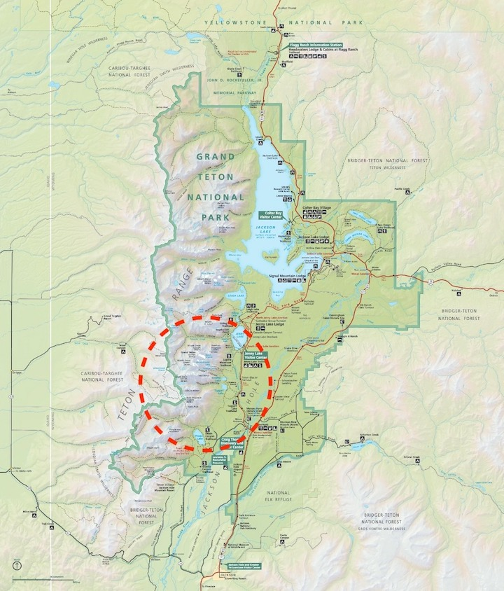

- [Backpacking Trip 2021](#backpacking-trip-2021)
  - [GPS Tracker](#gps-tracker)
  - [Backpack Route](#backpack-route)
  - [People](#people)
    - [Contacts](#contacts)
    - [Permit Info](#permit-info)
    - [Emergency Contact](#emergency-contact)
  - [Itinerary](#itinerary)
    - [Details](#details)
    - [Bear Safety](#bear-safety)
    - [Jackson Webcams](#jackson-webcams)
  - [Preparation](#preparation)

# Backpacking Trip 2021

*** PLEASE DO NOT SHARE ***

*** PLEASE DO NOT SHARE ***

*** PLEASE DO NOT SHARE ***

## GPS Tracker

* TODO

## Backpack Route

- [Topo Map Detailed](https://caltopo.com/m/NP1F)
<!-- Backpack Route -->
<figure class="iframe_container">
  <iframe src="https://caltopo.com/m/NP1F" width="2005" height="1000" frameborder="0" scrolling="no">
  </iframe>
</figure>
<!-- Backpack Route -->

 | Day | Distance | Gain  | Loss  | Notes                                                 |
 | --- | -------- | ----- | ----- | ----------------------------------------------------- |
 | 1   | 6        | +2300 | -280  | Camp at Cascade South Fork Zone                       |
 | 2   | 6        | +2100 | -1500 | Camp at Alaska Basin - Basin Lakes                    |
 | 3   | 0        | +0    | -0    | Camp at Alaska Basin - Basin Lakes (Rest/Explore Day) |
 | 4   | 8        | +1000 | -2100 | Camp at Death Canyon Zone (Start Early)               |
 | 5   | 8        | +500  | -2600 | Exit                                                  |

- [Trip Report Video](https://www.youtube.com/watch?v=BGDntCrl6ak)
<!-- Trip Report Video -->
<iframe
    width="640"
    height="480"
    src="https://www.youtube.com/embed/BGDntCrl6ak"
    frameborder="0"
    allow="autoplay; encrypted-media"
    allowfullscreen
>
</iframe>
<!-- Trip Report Video -->

## People

### Contacts
- Kiran Babu (+1-214-934-9512) / Divya (+1-214-228-5356)
- Sandesh (+1-512-522-9795 / WA: +91 99862 54990) / Shrigowri (+91-7204848779 / WA: +91 94810 59418)
- Shaman (+1-814-852-8991) / Shrigowri (+91-7204848779 / WA: +91 94810 59418)
- Ranganath (+1-206-660-4142) / Nandini (+1-206-660-4132)

### Permit Info

### Emergency Contact
- Grand Teton National Park (+1-307-739-3309 / +1-307–739​–3399)
- 911 
- Notified People (Trackers)
  - Rishab Animesh (TBD) 
  - Divya (TBD)

## Itinerary 

| Date  | Time | Event  | Details  | Notes                                                 |
| ---   | ---- | ----- | ----- | ----------------------------------------------------- |
| 07/30 | 1630 | Arrive San in SLC  | DL 2156 | |
| 07/30 | 1730 | San Pickup Rental Car  | Avis | |
| 07/30 | 1830 | San Checkin  | DoubleTree near SLC | |
| 07/30 | 1930 | San Pickup !!!Gas!!!, Water, !!!Matches!!!, !!!Lighter!!! Etc  | DoubleTree near SLC | |
| 07/30 | 2100 | Arrive Shaman in SLC  | DL 727 | |
| 07/31 | 0900 | Confirm TH Shuttle  | Teton Mountain Taxi  | |
| 07/31 | 1600 | Arrive Kumar in SLC  | DL 2428 | | Arrives @ 16:00 
| 07/31 | 1700 | Arrive Kiran in SLC  | AA 2065 | | Arrives @ 
| 07/31 | 1800 | Leave for Evanston  |  | |
| 07/31 | 2000 | Arrive Evanston & Checkin  | Hampton Inn, Evanston, WY / 82255529 / Haya  | |
| 08/01 | 0800 | Leave Evanston  | | |
| 08/01 | 1200 | Arrive In Jackson | | |
| 08/01 | 1200 | Pickup Permit from NP Office | | | Craig Thomas Discovery & Visitor Center (307) 739-3309
| 08/01 | 1500 | Checkin | Flat Creek Inn / Agas Haya / Expedia 72027169636000 | |
| 08/01 | 1600 | Pickup Rental Items | | | Teton Backcountry Rentals (307) 828-1885
| 08/01 | 1700 | Pack Bags & Item Check | | |
| 08/02 | 0700 | Checkout | | |
| 08/02 | 0800 | Laurance Rockefeller Preserve Parking Lot | | | Shuttle Info : Teton Mountain Taxi (307) 699 7969
| 08/02 | 0900 | Jenny Lake Boat Launch | [Take Jenny Lake Boat Shuttle to CC TH](https://jennylakeboating.com/boat-trips/shuttle-service/) | | (307) 734-9227
| 08/02 | 1000 | Start from CC TH | | |
| 08/06 | 1500 | Arrive Laurance Rockefeller Preserve Parking Lot | | |
| 08/06 | 1600 | Dropoff Rental Items | | | Teton Backcountry Rentals (307) 828-1885
| 08/06 | 1800 | Arrive Idaho Falls & Checkin | Hampton Inn, Idaho Falls, ID / 82779337 / Haya | |
| 08/07 | 0900 | Checkout | | |
| 08/07 | 1300 | Drop Kiran at SLC  | AA 2846 | | Departs @
| 08/07 | 1330 | Drop Kumar at SLC  | DL 3588 | | Departs @ 15:30
| 08/07 | 1400 | Checkin  | Hampton Inn, SLC / 87235977 / Haya | |
| 08/08 | 1000 | Checkout  |  | |
| 08/08 | 1730 | Drop Rental Car  |  | |
| 08/08 | 0830 | Shaman Flight  | DL 570  | |
| 08/08 | 0830 | San Flight  | DL 370  | |

### Details
- Permit Details
  - Acquired Permit for 4 between Aug 2 and Aug 6
  - Needs to be picked up on Sunday 08/01 or 08/02 before 10 AM
- Jackson Stay Bookings 
  - Aug 1 - Done ($250)
  - Aug 6 - Done ($250)
- Shuttle Logistics
  - Booked with [Teton Mountain Taxi](https://jacksonholecab.com/taxi-reservation?booking_type=offers&route_pickup_category=0&route_pickup_poi=0&route_dropoff_category=0&route_dropoff_poi=0&pickup_date=&pickup_hr=00&pickup_min=00&passenger=0&suitcases=0&infantseats=0&childseats=0&boosterseats=0&return=0&return_date=&return_hr=00&return_min=00&coupons=0&&%)
  - Talked to persons and booked on phone. Need to confirm again in July 
  - Laurance Rockefeller Preserve Parking Lot -> Jenny Lake TH, 4 Ppl, 4 Bags, 08/02/2021 0800
- Jenny lake Boat Shuttle
  - [Shuttle](https://jennylakeboating.com/boat-trips/shuttle-service/)
- Rental Car from SLC
  - [Avis Reservation](https://view.e.avis.com/?qs=abcf9d152c44cc6b292134b2365aa21eee8006b990dc0d1364b4c552b3390061cd8302a64527a101c629af80f160ed62229516ab21351122f20e5e31fa8f563c1c8b4dd38307e934292c0ac7121a8da956053b53a99e5eb9)

- Things to Know
  - [GTNP Backcountry Info](https://www.nps.gov/grte/planyourvisit/upload/grte_backcountry.pdf)
  - Need to pickup permit a day ahead
  - Has trailhead shuttle logistics
  - Jackson, WY is extremely expensive to fly into and to stay
  - Bear country, need bear canister and precautions
  - Cooking gas canisters need to be bought at destination (as flying into)
  - Need to borrow sat communicator for emergency and location ping
  - Water is plenty on route and can optimize carry weight

### Bear Safety

- [1](http://www.tetonhikingtrails.com/grand-teton-national-park-bears.htm)
- [2](https://www.nps.gov/grte/planyourvisit/upload/bear_safety17-access.pdf)
- [3](https://www.nps.gov/glac/planyourvisit/bears.htm)
- [4](https://www.nps.gov/grsm/learn/nature/black-bears.htm)
- [5](https://www.nps.gov/articles/hiking-in-bear-country.htm)
- [6](https://www.nps.gov/subjects/bears/safety.htm)

### Jackson Webcams
- [Jenny Lake Boating](https://jennylakeboating.com/jenny-lake-webcam/)
- [GTNP](https://www.nps.gov/subjects/air/webcams.htm?site=grte)
- [American Alpine Club](http://www.americanalpineclub.org.php56-21.dfw3-2.websitetestlink.com/images/gtcr_webcam/webcam.jpg)
- [Jackson](https://www.youtube.com/watch?v=DoUOrTJbIu4)
- [Jackson](https://www.youtube.com/watch?v=WCOGjOAU_D8)
- [Jackson](https://www.youtube.com/watch?v=19cDoK1aP9o)
- [Jackson](https://www.youtube.com/watch?v=bMUgmKu5z1o)

## Preparation

- Items Check
  - See [Backpack Itemization](https://1drv.ms/x/s!Au4_6JRfzLRRnkEhQCpjtOc5AsKd?e=dUPQGH) for list of items, 'orange' is personal items which you need to get. Adjust as per your preference. Other 'shared' things are arranged.
  - For clothes, please use whatever is comfortable for you. Eg. I like to use shorts/tshirt. Ideally long sleeve shirt and pants are better due to high UV. It's just a personal preference based on comfort. So use what suits you best.
  - Also something for rain/wind/cold
    - Eg. I am using poncho, fleece and light wind-jacket
    - Alternatively you can use fleece & rain jacket
  - Doubly Ensure
    - Sleeping bag / Pad
    - Shoes
    - Backpack
    - Food Plan
    - any essentials
- Packing the bag
  - Test load the backpack, so no surprises. 
  - Shared Weight Approx : 5.25 Kg / Per Person ( Includes : Bear Canisters, Tent, Cooking Stuff - Stove, Gas, Plates, Water Filter, Morning+Evening Food, FA Kit ). So your total backpack weight will be inclusive of this.
  - Let me know any questions / changes required. Please post pics and your weight so that we can adjust.
  - Personally, I remove everything not needed in a backpack. I use a thick trash bag as liner for bag to waterproof. Also while packing things, I try to avoid any sub-covers etc, which just add up weight.
  - How you pack the bag matters a lot for comfort. Basically the weightiest/densest items should close to your spine at the upper portion of your back, just around and below neck. The bottom of back should be soft/low-density (sleeping-bag). How I pack my bag has really changed weight carrying comfort personally. You need to pack and do some 2-3 mi walk to keep adjusting till you get to a good spot
  - Also, I personnally use weight-belt for carrying bag, Just personal preference as it distributes the weight a little bit betters, althought a bit uncomforable to keep adjusting and take on/off the bag.
  - Water : keep light water bottles like Platypus canteens or ultra-light throw away water bottles.
- Physical Conditioning
  - I try to do some regular running, weighted-backwack walks, squats. Also will try to do 2 conditining hikes of 8 mi. 
- Adjusting to bag weight
  - Practice walking with shoes and realistically loaded backpack. Need to get comfortable. Only way is keep doing walks with representative load and shoes. Like when you to for a daily walk of 2-3,mi, just carry the weight
  - Need to do possibly 2 of 8mi hikes with full load when you get a chance.
  - Please do not do anything strenous on last 7 days. Last time, the other guy did s test/training hike on the day before the actual hike and he got totally dehydrated. You body needs to recover for atleast a week.
- Food Plan  
  - Current plan is shared bfast {oats, uphitt} for 4 mornings & dinner {kichdi} for 4 nights
  - Common stove, gas and pot
  - For afternoon, make and get personal preference snacks, ideally no cooking required. All items should fit in 1.25 bear canisters for all 4 ppl.
    - Eg. My afternoon meal is { peanuts, mejdool-dates, corn-chips, seaweed }. Please get what you prefer and works for you.
  - If other meal plan required, please send details to adjust things.
