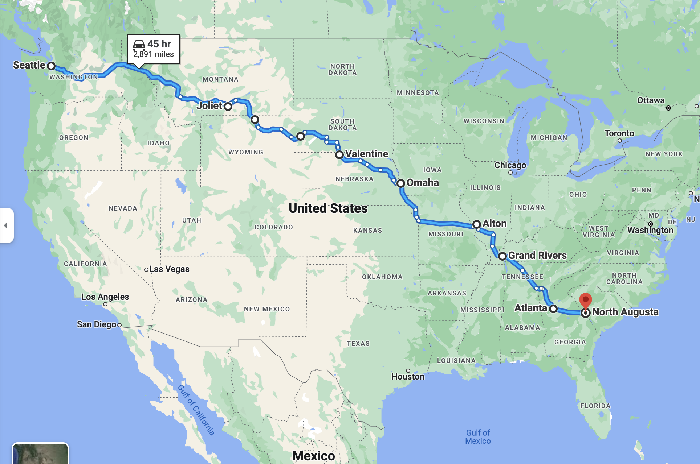

- [East Trip 2022](#east-trip-2022)
  - [Tracking](#tracking)
    - [Contacts](#contacts)
    - [Emergency Contact](#emergency-contact)
    - [When To Contact Emergency](#when-to-contact-emergency)
  - [Itinerary](#itinerary)
  - [Route](#route)

# East Trip 2022

*** PLEASE DO NOT SHARE ***

*** PLEASE DO NOT SHARE ***

*** PLEASE DO NOT SHARE ***

## Tracking

### Contacts

| Contact | 
| -------- | 
| Sandesh (+1-512-522-9795 / WA: +91 99862 54990) |
| Car : WA AOH2246, Ford Fiesta ST Silver 2014 Hatchback |

### Emergency Contact
- Notified People (Trackers)
  - Shaman (+1-814-852-8991)
  - Rishab Animesh (+1-607-793-3515) 

### When To Contact Emergency
- If you dont hear from me for 2 days
  - First try contacting me on my phone or whatsapp for 12 hours
  - If you cannot reach me, call 911 with my route plan

## Itinerary 

| Date  | Time | Event  | Details  | Notes                                                 |
| ---   | ---- | ----- | ----- | ----------------------------------------------------- |
| 09/22 | 0600 | Drive Seattle to Charo, MT | [route](https://www.google.com/maps/dir/Seattle,+WA/Ninepipes+Lodge,+U.S.+93,+Charlo,+MT/@47.3031599,-120.4634257,7z/data=!3m1!4b1!4m13!4m12!1m5!1m1!1s0x5490102c93e83355:0x102565466944d59a!2m2!1d-122.3320708!2d47.6062095!1m5!1m1!1s0x5367629751af146b:0xc63ac926033e2775!2m2!1d-114.0964255!2d47.4406737) | Stay at Nine Pipes Logdge Charo, MT (San Dodd)
| 09/23 | 1300 | Drive Charo, MT to Bozeman, MT | [route](https://www.google.com/maps/dir/Ninepipes+Lodge,+U.S.+93,+Charlo,+MT/Bozeman,+MT/@46.5555662,-113.7320218,8z/data=!3m1!4b1!4m13!4m12!1m5!1m1!1s0x5367629751af146b:0xc63ac926033e2775!2m2!1d-114.0964255!2d47.4406737!1m5!1m1!1s0x5345444c4fba8813:0x63f5d064f73b60aa!2m2!1d-111.0319925!2d45.6814733) | 
| 09/23 | 2030 | Pickup Shaman a Bozeman Aiport | | 
| 09/23 | 2100 | Drive Bozeman, MT to Joleit, MT | [route](https://www.google.com/maps/dir/Bozeman,+MT/Botts+Family+Motel,+Joliet+Montana/@45.4965105,-109.0144386,13.51z/data=!4m13!4m12!1m5!1m1!1s0x5345444c4fba8813:0x63f5d064f73b60aa!2m2!1d-111.0319925!2d45.6814733!1m5!1m1!1s0x5348c11232c077a3:0xec4b64b897adb21b!2m2!1d-108.976045!2d45.48298) | Stay at Botts Family Hotel, Joliet, MT (San Dodd)
| 09/24 | 1000 | Drive Joliet, MT to Sheridan, WY | [route](https://www.google.com/maps/dir/Botts+Family+Motel,+Joliet+Montana/Lovell,+WY/Sheridan,+WY/@45.127394,-108.5276696,9z/data=!3m1!4b1!4m20!4m19!1m5!1m1!1s0x5348c11232c077a3:0xec4b64b897adb21b!2m2!1d-108.976045!2d45.48298!1m5!1m1!1s0x53496643c59ae063:0x49a94b9ab75b3fc5!2m2!1d-108.3895614!2d44.8374532!1m5!1m1!1s0x5335fa943c6fad65:0x293a47fe7b11d57b!2m2!1d-106.9561791!2d44.7971939!3e0) | Stay at Days Inn By Wyndam, Sheridan, WY  
| 09/25 | 1000 | Drive Sheidan, WY to Horse Thief Campgound, SD | [route](https://www.google.com/maps/dir/Sheridan,+WY/Devils+Tower,+WY/Horse+Thief+Lake,+Mount+Rushmore+UT,+SD+57751/@44.253316,-106.3428423,8z/data=!3m1!4b1!4m20!4m19!1m5!1m1!1s0x5335fa943c6fad65:0x293a47fe7b11d57b!2m2!1d-106.9561791!2d44.7971939!1m5!1m1!1s0x533306665439f6d1:0x4d1af79c027015f6!2m2!1d-104.6985456!2d44.5886461!1m5!1m1!1s0x877d358e5b45b33d:0x8402466b94968b47!2m2!1d-103.4818872!2d43.8930383!3e0) | Stay at [Horsethief Lake Campground](https://www.recreation.gov/camping/campgrounds/231840) 
| 09/26 | 1000 | Explore Mt Rushmore | | Stay at [Horsethief Lake Campground](https://www.recreation.gov/camping/campgrounds/231840) 
| 09/27 | 0800 | Drive Horsethief Lake Campground, SD to Omaha, NE | [route](https://www.google.com/maps/dir/Horse+Thief+Lake,+Mount+Rushmore+UT,+SD+57751/Scenic,+SD/Valentine,+NE/Omaha,+NE/@41.8122123,-98.9155926,7.96z/data=!4m26!4m25!1m5!1m1!1s0x877d358e5b45b33d:0x8402466b94968b47!2m2!1d-103.4818872!2d43.8930383!1m5!1m1!1s0x877db3de3a98bcb1:0x130a6ee764570b1a!2m2!1d-102.5548661!2d43.7797143!1m5!1m1!1s0x87827719204ca151:0xaa3f022775a4cf07!2m2!1d-100.5509669!2d42.8727833!1m5!1m1!1s0x87938dc8b50cfced:0x46424d4fae37b604!2m2!1d-95.9345034!2d41.2565369!3e0) | Stay at [Best Western Plus Omaha Aiport Inn](https://www.bestwestern.com/en_US/book/hotels-in-carter-lake/best-western-plus-omaha-airport-inn/propertyCode.16107.html) 
| 09/28 | 0500 | Drop Shaman a Omaha Aiport | | 
| 09/28 | 1000 | Drive Omaha, NE to Alton, IL | [route](https://www.google.com/maps/dir/Omaha,+NE/Hannibal,+MO/Clarksville,+MO/Alton,+IL/@39.9810703,-95.3021169,7z/data=!3m1!4b1!4m26!4m25!1m5!1m1!1s0x87938dc8b50cfced:0x46424d4fae37b604!2m2!1d-95.9345034!2d41.2565369!1m5!1m1!1s0x87dde8a4093156f5:0x9a8b4e4e76ebaa3c!2m2!1d-91.3584816!2d39.7083789!1m5!1m1!1s0x87de5bf517514c3d:0xef17f09a5bfe5391!2m2!1d-90.9051315!2d39.3706026!1m5!1m1!1s0x87df4263d500fbe7:0xedadd230a4c4c104!2m2!1d-90.1842764!2d38.8906038!3e0) | Stay at [Best Western Plus Parkway Hotel](https://www.bestwestern.com/en_US/book/hotels-in-alton/best-western-plus-parkway-hotel/propertyCode.14190.html)
| 09/29 | 1000 | Drive Alton, IL to Grand Rivers, KY | [route](https://www.google.com/maps/dir/Alton,+IL/Harrisonville,+IL/Cairo,+IL/Paducah,+KY/Canal+Campground,+1010+Canal+Campground+Rd,+Grand+Rivers,+KY+42045/@36.947365,-89.1268503,10.21z/data=!4m32!4m31!1m5!1m1!1s0x87df4263d500fbe7:0xedadd230a4c4c104!2m2!1d-90.1842764!2d38.8906038!1m5!1m1!1s0x87d8ea4c41e2ef93:0x2441f1f61989f404!2m2!1d-90.3501191!2d38.2775544!1m5!1m1!1s0x8879c6ace405f89f:0x1ea46c834803db68!2m2!1d-89.1764608!2d37.0053293!1m5!1m1!1s0x887a1060d12f85c3:0x1dc24c50850cb925!2m2!1d-88.6000478!2d37.0833893!1m5!1m1!1s0x887a611120951be1:0x847bb7d54cbbc759!2m2!1d-88.2164681!2d36.9960792!3e0) | Stay at Canal Campground, Grand Rivers, KY 
| 09/30 | 1000 | Drive Grand Rivers, KY to Atlanta, GA | [route](https://www.google.com/maps/dir/Canal+Campground,+1010+Canal+Campground+Rd,+Grand+Rivers,+KY+42045/Dover,+TN/Columbia,+TN/Huntsville,+AL/Atlanta,+GA/@35.3489138,-87.4621029,7.85z/data=!4m32!4m31!1m5!1m1!1s0x887a611120951be1:0x847bb7d54cbbc759!2m2!1d-88.2164681!2d36.9960792!1m5!1m1!1s0x887b220b49917b5b:0xd8fe8492037eaf1e!2m2!1d-87.8383567!2d36.4878291!1m5!1m1!1s0x88637171dce92331:0xdd976dec8f325f78!2m2!1d-87.0352831!2d35.6150716!1m5!1m1!1s0x88626b67cda2898d:0x9a2c7e89c804566b!2m2!1d-86.5861037!2d34.7303688!1m5!1m1!1s0x88f5045d6993098d:0x66fede2f990b630b!2m2!1d-84.3879824!2d33.7489954!3e0) | Stay at TBD
| 10/01 | 1000 | Stay At Atlanta, GA| | Stay at TBD 
| 10/02 | 1000 | Drive Atlanta, GA to Augusta, GA | [route](https://www.google.com/maps/dir/Atlanta,+GA/North+Augusta,+SC/@33.4813204,-83.7182263,9z/data=!3m1!4b1!4m14!4m13!1m5!1m1!1s0x88f5045d6993098d:0x66fede2f990b630b!2m2!1d-84.3879824!2d33.7489954!1m5!1m1!1s0x88f9cca12803caa5:0x366e37e61f71aa0c!2m2!1d-81.9651152!2d33.5018026!3e0) | Destination 

## Route

[Oveview Route Map](https://www.google.com/maps/dir/Seattle,+Washington/Joliet,+MT/Sheridan,+WY/Horse+Thief+Lake,+Mount+Rushmore+UT,+SD/Valentine,+NE/Omaha,+NE/Alton,+IL/Grand+Rivers,+KY/Atlanta,+GA/North+Augusta,+SC/@38.8313406,-109.3321762,4.68z/data=!4m62!4m61!1m5!1m1!1s0x5490102c93e83355:0x102565466944d59a!2m2!1d-122.3320708!2d47.6062095!1m5!1m1!1s0x5348c10e7fadb8cf:0xae08810644d99078!2m2!1d-108.9704265!2d45.4852243!1m5!1m1!1s0x5335fa943c6fad65:0x293a47fe7b11d57b!2m2!1d-106.9561791!2d44.7971939!1m5!1m1!1s0x877d358e5b45b33d:0x8402466b94968b47!2m2!1d-103.4818872!2d43.8930383!1m5!1m1!1s0x87827719204ca151:0xaa3f022775a4cf07!2m2!1d-100.5509669!2d42.8727833!1m5!1m1!1s0x87938dc8b50cfced:0x46424d4fae37b604!2m2!1d-95.9345034!2d41.2565369!1m5!1m1!1s0x87df4263d500fbe7:0xedadd230a4c4c104!2m2!1d-90.1842764!2d38.8906038!1m5!1m1!1s0x887a6138c440a1a1:0x87ee7cad902d5e11!2m2!1d-88.2344746!2d37.0031109!1m5!1m1!1s0x88f5045d6993098d:0x66fede2f990b630b!2m2!1d-84.3879824!2d33.7489954!1m5!1m1!1s0x88f9cca12803caa5:0x366e37e61f71aa0c!2m2!1d-81.9651152!2d33.5018026!3e0)
*** NOTE : PLEASE SEE DETAIL FOR DAY IN ITIN TABLE ***

