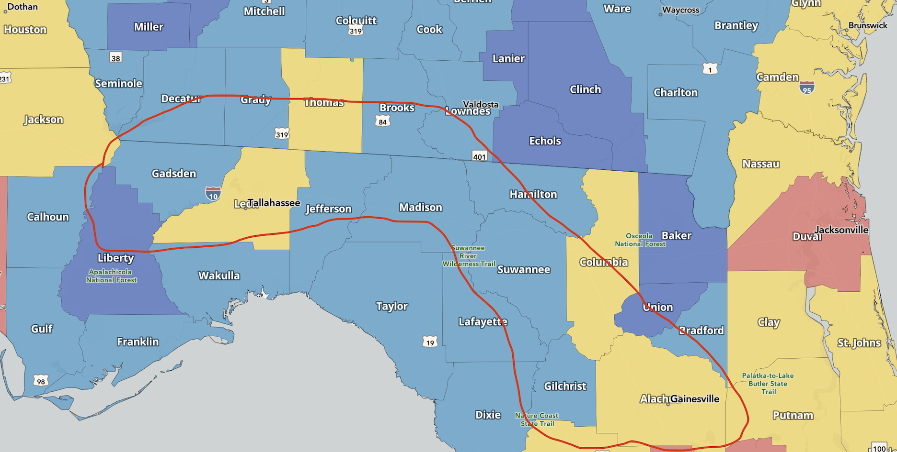

- [Property Requirements](#property-requirements)
  - [What is the purpose of property :](#what-is-the-purpose-of-property-)
  - [Few things what is important to me](#few-things-what-is-important-to-me)
  - [Property Type](#property-type)
  - [Neighboring / Adjoining Properties](#neighboring--adjoining-properties)
  - [Constraints](#constraints)
  - [Price Range](#price-range)
  - [Region](#region)
    - [Approximate Maps](#approximate-maps)
    - [Counties](#counties)
    - [Towns](#towns)

# Property Requirements

## What is the purpose of property :
- Primary living residence
- Have space to experiment with growing plants, vegetable and fruits. 
- Develop the land into a permaculture forest type land

## Few things what is important to me
- Land, Sorrounding Aspects and Location are much more imporant and higher priority than the actual house or built up space. 
- Property should be sorrounded by mostly quiet regions with natural growth forests preferably. Away from major urban and developed areas.
- Property should not in busy locations or congested areas, high growth-forecasted areas and away from cities and towns preferably.
- Definetely outside in 100mi radius of a big metro.
- Absolutely no HOA or somebody telling me that I cannot dry clothes in the sun, cannot raise chickens or how my yard should look like.

## Property Type
- Land
  - 5-10 acre of land. Can be rural, farm, forest, agricultural. Should have lower taxes. (can go low as 3 acr, if adjoining is forest which is conserved)
  - Should have 60-100% natural wooded / growth trees cover. I see properties where it is convered to pasture by cutting and selling all trees. I need natural growth trees. Even 100% is ok. I can cut/clear what I want.
  - SHould be in a region / adjoining / sorroundings which are away from busy/congested areas. Ideally it will be in a dead-end spot or adjoining forests which are conserved. 
  - Water well should be inspectable and water table / availability should not have problems (i.e historically)
  - Access to reliable electricity (if no services, should be easy or feasbile to get electricity connected)
  - Access to reliable Internet servies
  - ABSOULTELY NO HOA OF ANY SORT. Sub-division agreements or land agreements are OK and can be considered on per-case basis.
  - If has septic tank, should not have any problems
  - Relatively should be off main roads and highways, but the access should be directly to public road (not passing via some other property)
  - No high-volate electric lines running over property 
  - No extremely steep grades on property. 
  - There can be minor flood zones on small portion of land, but this has to be determined on per-case basis.

- Built Space
  - Small, Less than 1500-2000 sft (preferably with -2 car garage, attached or detached)
  - Something not expensive. i.e no fancy stuff. Just bare-minimum. Should be clean and solid.
  - No major structural problems, but I can work with things whose roofing needs to be replaced, some minor or major predictable repairs
  - No mobile homes or semi-mobile homes. 
  - Preferably metal roofing. 
  - Preferably should have outdoor seating spaces.

- Note : 
  - As I have been observing and checking out properties since 2-3 months in this region, I feel there are properties with really big/expensive buildings OR they have mobile homes. So I am open to just look for pure land, either developed or un-developed and I can build somethign simple on it myself slowly.

## Neighboring / Adjoining Properties
## Constraints
- No HOA
- Should be off major roads. Secluded ok, but not too remote.
- Ideally would be close to or adjoining some state or conservation land which will not have long term change.
## Price Range
- With built-house around 400-450K (Can be a bit flexible based on real value or future prospects of property)
- Only land (approx 10 ac) : 100-200K (depends on a lot of factors, just setting the range)

## Region
- Northern Florida & a small portion of Sothern Georgia
- NOTE : I have chosen within the Southeast ONLY. Mainly within NC, SC, GA, FL. I am also open to considering MS if this does not work out. NC, SC and GA, below or at the boundary of the Piedmont.
- Ideally within 50mi of Talahasssee, FL or Gainesville, FL
- See Counties & Towns below.

### Approximate Maps

### Counties
- Northern Florida
  - Gadsden
  - Leon
  - Jefferson
  - Madison
  - Lafayette
  - Suwanee
- South Georgia
  - Decatur
  - Grady
  - Thomas
  - Brooks

### Towns 
- Thomasville, GA
- 50 mi around Talahassee, FL
- Havana, FL
- 50 mi around Gainesville, FL
- Madison, FL
- Monticello, FL
- Lake City, FL
- Live Oak, FL
- Mayo, FL  
